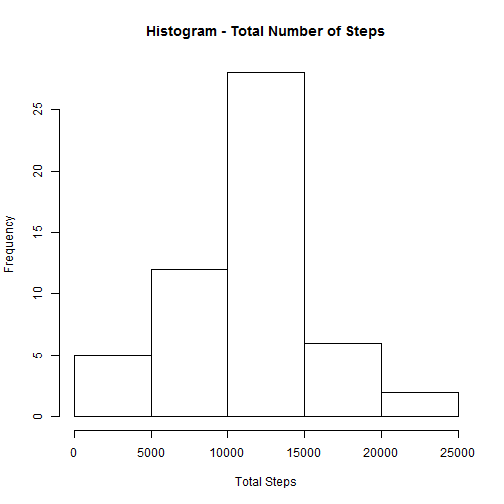
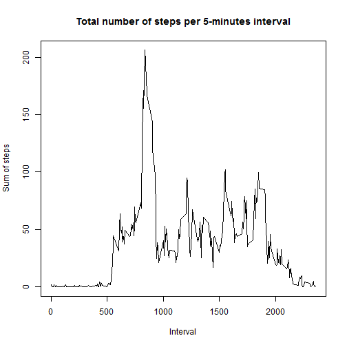
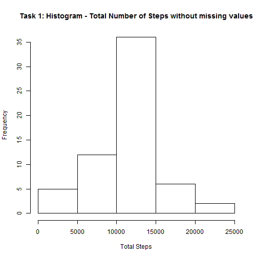
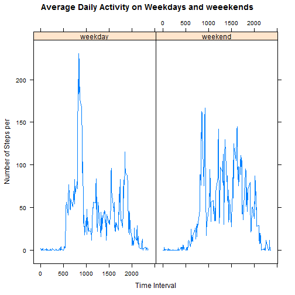

We first introduce libraries **dplyr**, **lubridate** and **lattice**, and then load the data:


```r
library(dplyr)
```

```
## 
## Attaching package: 'dplyr'
## 
## The following objects are masked from 'package:stats':
## 
##     filter, lag
## 
## The following objects are masked from 'package:base':
## 
##     intersect, setdiff, setequal, union
```

```r
library(lubridate)
library(lattice)
mydata <- read.csv("viikkoprojekti/repdata_data_activity/activity.csv", na.strings="NA")
```

Then we modify text based date as POSIX date field:


```r
mydata$date <- as.Date(mydata$date,"%Y-%m-%d")
```

## What is mean total number of steps taken per day?

We create a new data frame called **sumbyday** to group data by date, and summarise steps by date
  

```r
 sumbyday <- mydata %>%
 filter(!is.na(steps)) %>%
 group_by(date) %>%
 summarise(totalsteps=sum(steps)) 
```

Then we calculate mean and average of steps:


```r
 mean_of_steps = mean(sumbyday$totalsteps)
 median_of_steps = median(sumbyday$totalsteps)
 mean_of_steps
```

```
## [1] 10766.19
```

```r
 median_of_steps
```

```
## [1] 10765
```

We print the histogram based on sumbydat data frame:


```r
hist(sumbyday$totalsteps, xlab="Total Steps", main="Histogram - Total Number of Steps")
```

 

##What is the average daily activity pattern?

We group data by interval and calculate sum of steps and average of steps:


```r
byinterval <- mydata %>%
  filter(!is.na(steps)) %>%
  group_by(interval) %>%
  summarise(totalsteps=sum(steps),average.steps=mean(steps)) 
```

Time series for Total number of steps per 5-minutes interval:


```r
with(byinterval,plot(byinterval$interval, byinterval$average.steps, type="l",main="Total number of steps per 5-minutes interval", xlab="Interval",ylab="Sum of steps"))
```

 


Then we calculcate maximum number of steps in a five minute interval


```r
maxint <- max(byinterval$totalsteps)
byinterval[maxint, ]
```

```
## Source: local data frame [1 x 3]
## 
##   interval totalsteps average.steps
##      (int)      (int)         (dbl)
## 1       NA         NA            NA
```


## Imputing missing values

We Calculate and report the total number of missing values in the dataset


```r
nr.na <- sum(is.na(mydata$steps))
nr.na
```

```
## [1] 2304
```

Replace missing values from the mean of the 5- minute interval


```r
mydata.withoutNA <- mydata %>%
  group_by(interval) %>%
  mutate (steps = ifelse(is.na(steps), mean(steps,na.rm=TRUE), steps))
```

Then we calculate sum of steps in each day for that mutated data set.


```r
sumbyday.withoutNA <- mydata.withoutNA %>%
  filter(!is.na(steps)) %>%
  group_by(date) %>%
  summarise(totalsteps=sum(steps))
```

We calculate and report mean of steps and median of steps of mutated data set


```r
mean_of_steps_withouthNA = mean(sumbyday.withoutNA$totalsteps)
median_of_steps.WithouthNA = median(sumbyday.withoutNA$totalsteps)
mean_of_steps_withouthNA
```

```
## [1] 10766.19
```

```r
median_of_steps.WithouthNA
```

```
## [1] 10766.19
```

and finally print histogram of sum of steps without missing values


```r
hist(sumbyday.withoutNA$totalsteps, xlab="Total Steps", main="Task 1: Histogram - Total Number of Steps without missing values")
```

 

The impact of replacing NAs with mean values is that number of steps will grow (obviously), but also histogram chart will be more balanced around central point

##Are there differences in activity patterns between weekdays and weekends?

First we use function **wday()** whichreturns weekday as a number 01-07, Sunday is 1.
Then we modify the data set to contain information wether the date is a 'weekday' or 'weekend'

```r
mydata.withoutNA$weekday <- wday(mydata.withoutNA$date)  
mydata.withoutNA$daytype <- ifelse(mydata.withoutNA$weekday %in% c(7,1), "weekend", "weekday" )
```

now we group data by daytype and interval


```r
mydata.daytype <- mydata.withoutNA %>%
  group_by(daytype,interval) %>%
  summarise(total.steps = sum(steps, na.rm=TRUE), average.steps=mean(steps,na.rm=TRUE))
```

then we use lattice library xyplot function to plot both weekend and weekdays charts


```r
xyplot(average.steps~interval|daytype, data=mydata.daytype,type="l", main="Average Daily Activity on Weekdays and weeekends", ylab="Number of Steps per", xlab="Time Interval")
```

 

